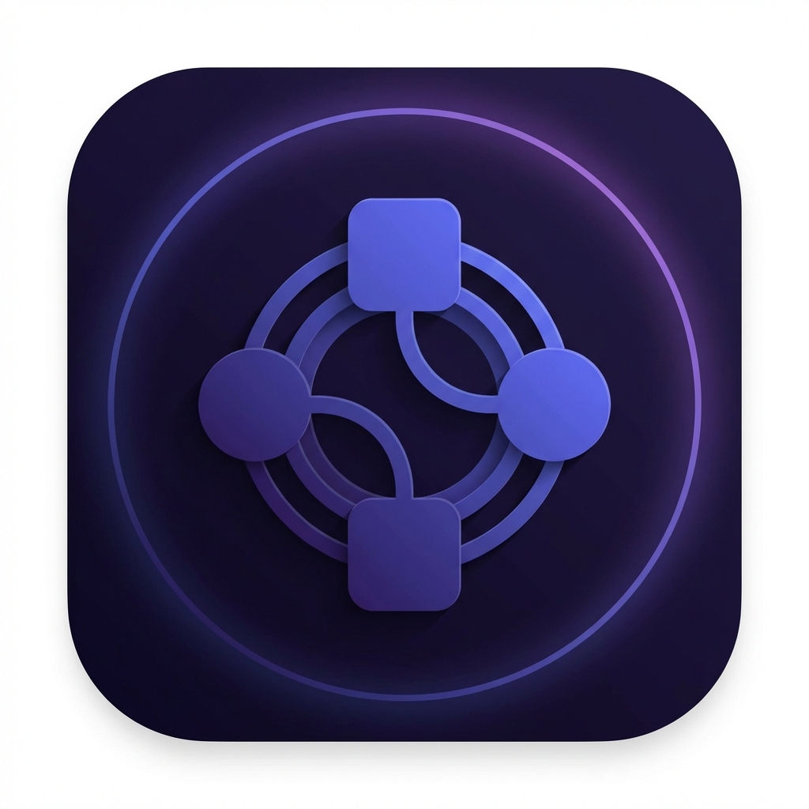

# Flowgent - AI-Powered Assistant for n8n Workflows

**An intelligent browser extension that helps you build, debug, and optimize n8n automation workflows using Google's Gemini AI.**



## ✨ Features

### 🤖 AI Chat Assistant
- Natural language workflow creation: "Create a workflow that sends daily Slack notifications"
- Debug and fix broken workflows
- Import and analyze workflow JSON
- Get instant answers about n8n nodes and best practices
- Powered by **Google Gemini 2.0 Flash** with n8n expertise

### ℹ️ Information Hand
- Hover over any n8n node to see instant documentation
- Displays:
  - Node description and parameters
  - Common use cases
  - Best practices
  - Example configurations
- Works with custom nodes too!

### 📊 Dashboard
- View all your workflows in one place
- Execution history and status
- Quick workflow actions (run, view details)
- Test workflows with custom input data

## 🏗️ Architecture

```
Flowgent/
├── backend/          # FastAPI + Google Agent SDK
│   ├── agent/        # Gemini AI agent configuration
│   ├── api/          # REST API endpoints
│   ├── mcp/          # n8n MCP client
│   └── models/       # Pydantic schemas
└── extension/        # Chrome Extension (Manifest V3)
    ├── sidepanel/    # Chat + Dashboard UI
    ├── content/      # Information Hand tooltips
    └── lib/          # Shared utilities
```

## 🚀 Quick Start

### Prerequisites
- Python 3.11+
- Chrome browser
- Google Gemini API key
- n8n instance (local or cloud)

### Backend Setup

1. **Install dependencies:**
```bash
cd backend
pip install -r requirements.txt
```

2. **Configure environment:**
```bash
cp .env.example .env
# Edit .env and add:
# - GEMINI_API_KEY=your-gemini-api-key
# - N8N_MCP_SERVER_URL=http://your-mcp-server-url
```

3. **Run the backend:**
```bash
python main.py
# Or with uvicorn:
uvicorn main:app --reload --port 8000
```

The backend will be available at `http://localhost:8000`

### Extension Setup

1. **Open Chrome Extensions:**
   - Navigate to `chrome://extensions/`
   - Enable "Developer mode" (toggle in top right)

2. **Load the extension:**
   - Click "Load unpacked"
   - Select the `extension` folder from this repository

3. **Configure backend URL:**
   - Click the Flowgent icon in Chrome toolbar
   - Go to Settings tab
   - Enter backend URL: `http://localhost:8000`
   - Click "Save Settings" and "Test Connection"

4. **Start using Flowgent:**
   - Navigate to your n8n instance
   - Open the Flowgent side panel
   - Start chatting with the AI! 🎉

## 🧪 Testing

### Test the Backend
```bash
# Check health
curl http://localhost:8000/health

# Test chat endpoint
curl -X POST http://localhost:8000/api/chat \
  -H "Content-Type: application/json" \
  -d '{"message": "What is n8n?"}'
```

### Test the Extension
1. Load the extension in Chrome
2. Open your n8n instance
3. Test Chat: Ask "Create a simple HTTP request workflow"
4. Test Information Hand: Hover over nodes to see tooltips
5. Test Dashboard: View your workflows list

## 🌐 Deployment

### Deploy Backend to Google Cloud Run

1. **Build and deploy:**
```bash
cd backend
gcloud run deploy flowgent-backend \
  --source . \
  --region us-central1 \
  --allow-unauthenticated \
  --set-env-vars GEMINI_API_KEY=your-key,N8N_MCP_SERVER_URL=your-mcp-url
```

2. **Update extension settings:**
   - Set backend URL to your Cloud Run URL
   - Test connection

### Using Cloud Build (CI/CD)
```bash
gcloud builds submit --config cloudbuild.yaml
```

## 📚 API Documentation

### Endpoints

| Endpoint | Method | Description |
|----------|--------|-------------|
| `/health` | GET | Health check and status |
| `/api/chat` | POST | Chat with AI assistant |
| `/api/workflows` | GET | List all workflows |
| `/api/workflows/{id}` | GET | Get workflow details |
| `/api/execute` | POST | Execute a workflow |
| `/api/node-info/{type}` | GET | Get node information |
| `/api/executions` | GET | Get execution history |

### Example: Chat Request
```json
POST /api/chat
{
  "message": "Create a workflow to fetch GitHub issues",
  "context": {
    "currentPage": "n8n.io/workflow/123"
  }
}
```

## 🛠️ Tech Stack

**Backend:**
- FastAPI - Modern Python web framework
- Google GenAI SDK - Gemini 2.0 Flash integration
- Google Agent Development Kit - Agentic AI capabilities
- Pydantic - Data validation
- httpx - Async HTTP client

**Frontend:**
- Chrome Extension Manifest V3
- Vanilla JavaScript (no frameworks)
- Modern CSS with dark mode
- Glassmorphism UI design

**Integration:**
- n8n MCP (Model Context Protocol) - Direct n8n access
- Google Cloud Run - Serverless deployment

## 🤝 Development

### Project Structure
- `backend/main.py` - FastAPI application
- `backend/agent/flowgent_agent.py` - AI agent logic
- `backend/mcp/n8n_client.py` - n8n MCP wrapper
- `extension/manifest.json` - Extension configuration
- `extension/sidepanel/` - Chat & dashboard UI
- `extension/content/` - Information Hand scripts

### Adding New Features

1. **Backend:** Add endpoints in `backend/api/routes.py`
2. **Agent:** Extend tools in `backend/agent/flowgent_agent.py`
3. **Extension:** Add UI in `extension/sidepanel/`
4. **Tooltips:** Modify `extension/content/tooltip.js`

## 🎯 Roadmap

- [ ] Multi-language support
- [ ] Workflow templates library
- [ ] Advanced workflow analytics
- [ ] Team collaboration features
- [ ] Chrome Web Store publication
- [ ] Firefox extension support

## 📄 License

MIT License - see LICENSE file

## 👥 Team

Built for **Agentic+ Product Hackathon** by Team Flowgent

---

## 💡 Tips

- **Chat works best with specific requests:** Instead of "help me", try "create a workflow that sends emails from Google Sheets"
- **Hover slowly on nodes:** Information Hand has a small delay to avoid flickering
- **Check connection status:** The header shows if backend and MCP are connected
- **Use Dashboard for quick actions:** View and execute workflows without leaving Chrome

## ❓ Troubleshooting

**Extension not loading?**
- Ensure Developer mode is enabled in `chrome://extensions/`
- Check for errors in Chrome DevTools console

**Backend connection failed?**
- Verify backend is running: `curl http://localhost:8000/health`
- Check firewall settings
- Confirm backend URL in extension settings

**Information Hand not showing?**
- Refresh the n8n page after loading extension
- Check if you're on a supported n8n page
- Open DevTools and check for errors

**AI not responding?**
- Verify GEMINI_API_KEY is set correctly
- Check backend logs for errors
- Ensure you have API quota remaining

---

**Happy automating with Flowgent! 🚀✨**
